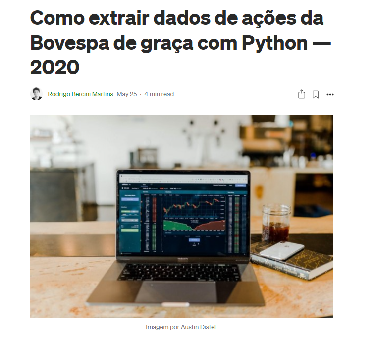

Instalar biblioteca

```
python -m pip install -r requirements.txt
```

Rodar o codigo localmente para teste

```
python bovespa.py 
```

Notebook do artigo [Como extrair dados da Bovespa de graça com Python](https://medium.com/@rodrigobercinimartins/como-extrair-dados-da-bovespa-de-graca-com-python-14a03454a720)

O código também está disponível em:
https://gist.github.com/rodrigobercini/8bbee7fc735ad7d696f7a2ec31df9610


